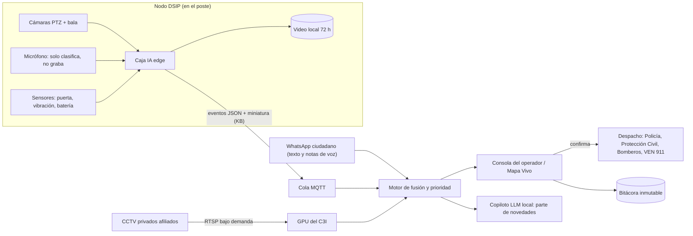

# Proyecto Panoptes — Evaluación de Marketing, Premortem/Postmortem y Plan de Mejoras con IA

> **Fecha:** septiembre 2026 · **Alcance:** repositorio `Panoptes` (sitio `index.html`, `dossier.html`/PDF, video `promo/`) y propuesta del addon de IA.
> **Cómo usar este documento:** cada mejora tiene un **ID**. Al final hay una **Tabla de Decisión** con `☐ Sí / ☐ No` para decidir qué se aplica.
> **Importante:** este repositorio es el **material comercial** (sitio, dossier y video). Aplicar una mejora aquí significa **presentarla y demostrarla** (sitio, simulador, dossier, video). El software real de IA requiere un repositorio de producto aparte (ver `IA-13` y la opción de prueba de concepto).
> **Descargo:** todas las cifras son estimaciones de 2026 (USD, puesto en Venezuela) a validar con cotización. Las referencias legales son orientativas y **no sustituyen asesoría jurídica**.

---

## 0. Resumen ejecutivo

1. **La idea es buena y está bien anclada en la realidad venezolana**: apagones, semáforos dañados, cámaras privadas aisladas, financiamiento vía publicidad. El simulador, el dossier y el video de 48 s son activos comerciales fuertes.
2. **El principal problema no es tecnológico sino de credibilidad**: hay contradicciones en cifras (“$0 al erario” vs. “pago único Gobernación”, 10 vs. 20 nodos, 4 h vs. 5 h de autonomía, 14 W de consumo) que un evaluador técnico o un concejal detectará en minutos.
3. **El segundo riesgo es reputacional**: el lenguaje de “ojo que todo lo ve / vigilancia total”, sumado a reconocimiento facial y (ahora) detección de multitudes, puede leerse como herramienta de control político. Hay que **reposicionar de “vigilar” a “cuidar”**.
4. **El addon de IA propuesto — “Panoptes Vital IA”** — convierte las cámaras en un sistema que **salva vidas**: persona desmayada, novedades (choques, humo, sabotaje), gritos/disparos y seguridad de multitudes. Diseñado **edge-first** (funciona sin internet y en apagón), **sin grabar conversaciones** y **sin identificar personas en reuniones**.
5. **Estrategia comercial recomendada:** entrar con una **oferta pequeña (“Plan Semilla” / nodo demostrativo de 90 días)**, cobrar con esquemas venezolanos (anticipo, hitos, Pago Móvil, tasa BCV) y **diversificar hacia clientes privados** (comercios, clínicas, agroindustria) para no depender solo de pagos del Estado.
6. **Sitio web pesado para Venezuela:** la carpeta `images/` pesa **113 MB** (PNG de 7–11 MB). En conexiones móviles venezolanas esto ahuyenta al decisor que abre el enlace por WhatsApp.

---

## 1. Diagnóstico del estado actual

### 1.1 ¿Qué hay hoy en el repositorio?

| Activo | Descripción | Estado |
|---|---|---|
| `index.html` (~352 KB) | Landing comercial de una página: Hero, Mapa GIS, Fusión Comercial, Ingeniería, DSIP, C3I, Factibilidad/ROI, Hoja de ruta, Add-ons, FAQ, Simulador C3I, Partners, Contacto | Completo, muy interactivo |
| `dossier.html` + `Panoptes_Dossier_Ejecutivo.pdf` | Dossier ejecutivo de 2 páginas | Bueno, conciso |
| `promo/` (Remotion) | Video promocional de 48 s para WhatsApp | Bueno |
| `images/` | 33 archivos, **113 MB** | Crítico por peso |
| Software del producto (C3I, IA) | No existe en este repo | Solo se representa en el simulador |

### 1.2 Tarjeta de evaluación de marketing (escala 1–10)

| Dimensión | Nota | Comentario |
|---|:---:|---|
| Claridad del problema | 8 | Apagones, 68 % de semáforos operativos, CCTV aislado: concreto y local |
| Propuesta de valor | 7 | Potente, pero mezcla muchas cosas (tráfico, seguridad, publicidad, 911) |
| Credibilidad de cifras | 4 | Contradicciones internas (ver H1–H5) |
| Diferenciación | 6 | La resiliencia energética y el modelo de pauta diferencian; la IA hoy es genérica (placas y rostros) |
| Prueba social | 4 | Obras reales de la empresa, pero ningún caso de videoanalítica medido ni carta de intención |
| Llamado a la acción | 6 | Teléfono/WhatsApp/correo; sin formulario ni CTA “solicitar levantamiento” |
| Rendimiento móvil | 3 | 113 MB de imágenes, Tailwind por CDN, sin *lazy loading* |
| Riesgo reputacional (inverso) | 4 | “Ojo que todo lo ve”, “Vigilancia Total”, biometría contra “lista prioritaria” |
| Ajuste a la realidad venezolana | 8 | Muy bien trabajado (Corpoelec, VEN 911, 0-800-EXTORSIÓN, LiFePO4) |
| **Promedio** | **5,6** | **Meta tras mejoras: ≥ 8** |

### 1.3 FODA

| Fortalezas | Oportunidades |
|---|---|
| Problema real y sentido por la población · Resiliencia en apagones · Modelo de autofinanciamiento · Empresa local con 14 años y obras demostrables · Simulador y video listos para WhatsApp | IA de “cuidado” (desmayos, emergencias) con alta aceptación social · Clientes privados que pagan en divisas · Agroindustria de Portuguesa (silos, cañaverales) · Servicios urbanos (huecos, botes de agua, alumbrado) · Alineación con planes de seguridad ciudadana y VEN 911 |
| **Debilidades** | **Amenazas** |
| Cifras inconsistentes · Sitio pesado · Dependencia de un solo cliente (Estado) · IA limitada a placas/rostros · Servidor central subdimensionado para IA · OPEX no cuantificado | Atrasos de pago del Estado · Cambios de autoridades · Vandalismo y robo (cables, baterías) · Conectividad inestable · Percepción de uso político de la vigilancia · Importación de hardware (plazos, aranceles) · Competencia de integradores y distribuidores con analíticas nativas |

### 1.4 Hallazgos verificables en el sitio

| ID | Hallazgo | Dónde | Riesgo |
|---|---|---|---|
| **H1** | “**$0 costo al erario**” (hero y dossier) vs. “**Pago único Gobernación** $81.709,55” para el C3I | `index.html` línea ~1801, KPI del hero, dossier p. 1 | **Alto**: parece engaño; el $0 aplica solo a la operación en Vía A, no a la inversión inicial |
| **H2** | “**20 Nodos Públicos DSIP**” + 100 CCTV = 120, pero el piloto es de **10 nodos**; además “5 viales + 5 no viales” vs. “10 intersecciones inteligentes” | líneas ~895, ~1811, ~1825 | Medio |
| **H3** | Autonomía “**4 horas**” en la tabla de costos vs. “**5 h**” en hero/FAQ; “**Consumo ECO: 14 W**” en el simulador es irreal con domo PTZ + 2 balas + switch PoE + radio (realista: ~80–120 W) | líneas ~1385, ~2683 | Medio-alto ante un ingeniero de Corpoelec o de la policía |
| **H4** | “**150+ empleos**” para un piloto de 10 nodos | dossier p. 1, sección empleo | Medio: suena inflado |
| **H5** | Demo con coincidencias de **97–99 %** contra “**CICPC Lista Prioritaria**” sin convenio documentado con el MPPRIJP/CICPC | líneas ~2721, ~2737, ~3175, ~3516 | Alto: promete una integración que depende del nivel nacional |
| **H6** | `images/` = **113 MB**; PNG de 7–11 MB; **0** imágenes con `loading="lazy"`; `logo.png` de **1,4 MB** como `og:image` (WhatsApp puede no mostrar la vista previa); Tailwind vía CDN (no recomendado en producción) | `images/`, `<head>` | Alto para la conversión |
| **H7** | Anonimización incompleta: las coordenadas del hero y nombres de avenidas/comercios permiten identificar la ciudad real | línea ~497 y secciones de mapa/factibilidad | Bajo-medio (según la intención del commit de anonimización) |
| **H8** | Sin captura de *leads* ni analítica: no se sabe quién abrió el dossier ni qué sección convence | todo el sitio | Medio |
| **H9** | Lenguaje de control: “Vigilancia Total”, “100 % soberano”, “destruir cualquier raíz de delincuencia” | hero, fusión comercial | Medio-alto reputacional |
| **H10** | OPEX no cuantificado: electricidad de la valla LED (una pantalla exterior de 3–6 m² puede consumir 0,5–2 kW en pico), tarifa de mantenimiento en Vía B, conectividad, reposición por vandalismo a cargo del Estado | Factibilidad/ROI | Alto ante un director de finanzas |
| **H11** | Un solo “servidor 2U Xeon con GPU” de ~$4,2 K para IA en tiempo real sobre hasta 120 cámaras | tabla C3I | Alto técnico: subdimensionado |

---

## 2. Premortem — “Es septiembre de 2027 y Panoptes fracasó. ¿Por qué?”

> Técnica: imaginar el fracaso ya ocurrido y listar sus causas para prevenirlas hoy.

| # | Causa del fracaso | Prob. | Impacto | Señal temprana | Mitigación |
|---|---|:---:|:---:|---|---|
| P1 | **El Estado pagó tarde o en bolívares devaluados**; Electro Shop se descapitalizó a mitad de obra | Alta | Crítico | Retrasos en la orden de compra o en el primer pago | Anticipo ≥ 50 %, pagos por hito, contrato indexado en USD a tasa BCV del día de pago, cláusula de suspensión por mora, diversificación a clientes privados (NG-02, NG-03) |
| P2 | **Cambio de autoridades** (gobernación/alcaldía) y el nuevo gobierno desconoció el contrato | Media | Crítico | Año electoral, rotación de directores | Ordenanza aprobada por Concejo Municipal, acta con cuerpos de seguridad, resultados visibles en 90 días, comité de supervisión plural (GL-05) |
| P3 | **Las vallas no vendieron pauta**: economía local débil, pago “en línea” con tarjeta no funciona, vallas apagadas en apagones | Alta | Alto | Ocupación < 40 % a los 3 meses | Pago Móvil/C2P, transferencias y divisas; paquetes semanales; vendedor de calle; anunciantes ancla (banca, telecomunicaciones, bebidas); pauta institucional (NG-01, NG-05) |
| P4 | **Vandalismo y robo** de baterías de litio, cables y equipos; el Estado no repuso | Alta | Alto | Primer robo en los 60 días iniciales | IA anti-sabotaje (IA-04), gabinete antirrobo, baterías marcadas y rastreables, póliza y stock de repuestos (NG-07) |
| P5 | **Conectividad**: robo de fibra, radios P2P caídos, internet inestable | Alta | Alto | Nodos “offline” > 5 % del tiempo | Arquitectura *edge-first*: la IA corre en el poste, se envían solo eventos (KB, no Mbps), almacenamiento local, 4G multioperador (IA-13) |
| P6 | **Apagones más largos que la batería**; baterías degradadas por calor (gabinetes a 60 °C+), insectos/bachacos en las cajas | Media | Alto | Autonomía real < 4 h | Dimensionar para 8 h, modo apagón de IA a baja tasa de cuadros, ventilación y sellado, telemetría de salud de batería (IA-12) |
| P7 | **Fatiga de alarmas**: la IA dio tantos falsos positivos (cohetones, borrachos, quema de basura) que los operadores la ignoraron | Alta | Alto | > 5 falsas alarmas/nodo/día | Calibración con datos locales, umbrales por nodo y horario, humano en el lazo, motor de priorización (IA-08, IA-14) |
| P8 | **Escándalo de privacidad o uso político**: reconocimiento facial o conteo de multitudes usado contra manifestaciones; denuncias de ONG y prensa | Media | Crítico | Solicitudes de uso fuera de protocolo | Gobernanza de IA con prohibiciones explícitas, multitudes solo agregadas, bitácora inmutable, auditoría externa (GL-01 a GL-05). Precedente: reportajes internacionales (Reuters, 2018) sobre el proveedor tecnológico del Carnet de la Patria |
| P9 | **Sin operadores**: salarios públicos bajos, rotación alta, C3I vacío en la noche | Alta | Alto | Turnos sin cubrir | IA que prioriza (menos operadores por cámara), interfaz simple, bono co-financiado por pauta, formación con universidades locales (MK-09) |
| P10 | **Importación de hardware** (GPU, cajas de IA): plazos de 8–12 semanas, aranceles, precios altos | Media | Medio | Cotizaciones que vencen | Stock mínimo, hardware intercambiable (Jetson / RK3588 / Hailo), proveedores alternativos (Panamá, China) |
| P11 | **Integración con VEN 911/CICPC nunca se concretó** (depende del MPPRIJP, no del municipio) | Alta | Medio | Sin respuesta formal a los 60 días | Vender el valor local primero (Policía municipal/estatal, Protección Civil, Bomberos); convenios nacionales como fase posterior (GL-07) |
| P12 | **Competencia**: un integrador o distribuidor ofreció “cámaras + analíticas nativas” más barato | Media | Medio | Licitaciones con especificaciones de catálogo | Diferenciar por resiliencia energética, IA local calibrada, mantenimiento 24/7 y modelo de financiamiento; plataforma agnóstica (ONVIF/RTSP) |
| P13 | **Objeción por marca de hardware** al buscar socios o financiamiento con exposición a EE. UU. (Hikvision y Dahua figuran en listas restrictivas de EE. UU.) | Baja | Medio | Due diligence de un financista | Plataforma agnóstica de marca; opción de hardware alternativo en la cotización |

---

## 3. Postmortem — Retrospectiva de la fase comercial actual

> Técnica: revisar lo hecho (≈ 20 iteraciones del sitio, dossier, video) sin culpables, para extraer lecciones.

**Qué salió bien**
- Iteración rápida y constante: el sitio pasó de landing a simulador interactivo, dossier PDF y video de 48 s.
- Se corrigió proactivamente parte del presupuesto y se añadió contenido legal y de ciberseguridad (commit `2d71204`).
- La sección de Add-ons (app ciudadana, dron, alerta hidrometeorológica, satelital, SOS) ya prepara la narrativa de plataforma modular.
- La adaptación local (Corpoelec, VEN 911, 0-800-EXTORSIÓN, racionamiento) es un diferenciador real.

**Qué salió mal**
- No existe una **fuente única de cifras**: el sitio, el dossier y el video repiten números a mano y se desalinean (H1–H4).
- Se priorizó el “efecto *wow*” (imágenes de 10 MB, animaciones) sobre la **velocidad en conexiones venezolanas** (H6).
- La IA se presenta como **reconocimiento de placas y rostros**, justo lo más sensible y lo que depende de bases de datos nacionales.
- No hay **evidencia de campo** (piloto medido, carta de intención, testimonio) ni forma de medir el interés (H8).

**Causas raíz**
1. Material construido como vitrina, sin una revisión de “evaluador escéptico” (finanzas, ingeniería, legal).
2. Sin presupuesto de rendimiento ni prueba en 3G/4G lento.
3. Narrativa centrada en el Estado como único comprador.

**Lecciones → acciones**
| Lección | Acción |
|---|---|
| Una cifra, una fuente | Crear un `datos.json` único que alimente sitio, dossier y video (CR-09) |
| El decisor abre el enlace en el teléfono | Presupuesto de peso < 5 MB para la primera carga (WEB-01 a WEB-04) |
| La IA que salva vidas vende mejor que la IA que identifica | Liderar con Panoptes Vital IA (IA-01 a IA-06) |
| Sin prueba no hay confianza | Nodo demostrativo de 90 días con métricas públicas (MK-04) |

**Retrospectiva prospectiva (el caso de éxito en 2027)** — para que Panoptes funcione, tuvo que ser cierto que: (a) se firmó un Plan Semilla pequeño y rápido; (b) en 90 días hubo **un caso real publicable** (p. ej., “persona desmayada atendida en 4 minutos”); (c) los comercios pagaron por las alertas de IA sobre sus propias cámaras; (d) no hubo ni un solo escándalo de privacidad.

---

## 4. Propuesta central: addon **“Panoptes Vital IA”**

**Posicionamiento:** *“Del ojo que vigila al ojo que cuida.”*
**Pitch de 20 segundos:** *Panoptes Vital convierte las cámaras que el municipio ya tiene en un vigía que nunca parpadea: detecta a una persona desmayada, un grito de auxilio, un choque o una multitud en peligro, y pone la alerta frente al operador en segundos — sin grabar conversaciones y sin identificar a nadie en una reunión.*

### 4.1 Principios de diseño adaptados a Venezuela

| Principio | Por qué en Venezuela |
|---|---|
| **Edge-first / offline-first** | La IA corre en el poste: sigue funcionando si cae la fibra o el internet |
| **Eventos, no video** | Se envían eventos JSON + miniatura (≈ 50–150 KB) en vez de 2–4 Mbps por cámara; cabe en radios P2P y 4G |
| **Modo apagón** | En batería, la IA baja a 2–5 cuadros/s y prioriza los módulos vitales para no restar autonomía |
| **Humano en el lazo** | La IA sugiere; el operador confirma antes de despachar. Nadie es detenido por un algoritmo |
| **Privacidad por diseño** | Audio sin grabación; multitudes solo en conteos agregados; difuminado de rostros en exportaciones |
| **Software libre y licencias limpias** | Coherente con la Ley de Infogobierno (2013) y el Decreto 3.390; evitar licencias AGPL (p. ej. Ultralytics YOLO) si el código será propietario |
| **Hardware intercambiable** | Jetson (NVIDIA), RK3588 o Hailo-8 según disponibilidad y precio de importación |
| **Escalonado en 3 niveles** | Nivel 0: analíticas nativas de las cámaras (costo casi cero) → Nivel 1: caja IA en el poste → Nivel 2: GPU en el C3I |

### 4.2 Arquitectura propuesta

### 4.3 Módulos de IA

#### IA-01 · Persona caída / desmayada (“hombre caído”)
- **Qué detecta:** persona que cae y queda inmóvil en el suelo más de N segundos (configurable, 45–90 s).
- **Casos venezolanos:** golpes de calor (Portuguesa supera con frecuencia los 35 °C); pensionados y adultos mayores en colas de bancos; pacientes crónicos sin medicamentos; motorizado caído tras un choque; entrada del hospital; paradas de transporte público.
- **Cómo funciona:** detección de personas + estimación de pose (puntos clave) + seguimiento; regla temporal (orientación horizontal + inmovilidad). El PTZ hace *zoom* automático y el operador confirma con un clic.
- **Falsos positivos locales y mitigación:** personas durmiendo en la calle (se deriva a servicios sociales, no a policía); personas ebrias frente a licorerías; **mecánicos acostados bajo carros en talleres de acera** (zonas de exclusión); niños jugando; perros grandes. → zonas y horarios configurables, tiempo mínimo, verificación con PTZ.
- **Meta:** alerta en < 60 s; ≥ 70 % de alertas verdaderas tras 3 meses de calibración.
- **Mensaje comercial:** *“La primera IA del país que llama a la ambulancia antes que los curiosos.”*

#### IA-02 · Novedades viales
- **Qué detecta:** choques, moto caída, vehículo detenido en intersección, contrasentido, peatón en calzada, semáforo sin respetar (estadístico, no para multar sin ordenanza).
- **Casos:** los accidentes de moto son una causa principal de traumatismos en la región; intersecciones sin semáforo durante apagones.
- **Plus:** combinado con IA-05 (sonido de impacto/frenazo) sube la confianza de la alerta.

#### IA-03 · Humo e incendio
- **Qué detecta:** humo y llama en la vía pública, terrenos baldíos, vegetación y, para clientes agro, cañaverales y silos.
- **Falsos positivos locales:** quema de basura (frecuente), humo de parrillas de ventas de comida, polvo en temporada seca, neblina matinal, escapes diésel. → persistencia, crecimiento del área, zonas y horarios.
- **Valor:** en temporada seca los incendios de vegetación son recurrentes; aviso a Bomberos y Protección Civil.

#### IA-04 · Anti-sabotaje y robo del propio nodo
- **Qué detecta:** cámara tapada, girada o desenfocada; apertura de gabinete; vibración o escalada del poste; desconexión o caída brusca de batería; persona merodeando el poste de noche.
- **Por qué es clave en Venezuela:** el robo de cables y baterías es una amenaza directa al proyecto (P4). **Este módulo protege la inversión** y es fácil de vender a finanzas.
- **Falsos positivos:** telarañas e insectos atraídos por el IR nocturno, lluvia fuerte en el lente, pájaros. → limpieza programada, filtros temporales.

#### IA-05 · Audio: gritos, disparos, vidrios rotos, impactos
- **Qué detecta:** gritos de auxilio, detonaciones, rotura de vidrios, choque/frenazo, alarmas.
- **Cómo funciona:** clasificador de eventos acústicos en el poste (modelos abiertos tipo YAMNet/PANNs) sobre un búfer circular de 1–2 s **en memoria**. **Nunca** se guarda ni se transmite audio: solo la etiqueta (“grito”, 0,86, 21:14:03, DSIP-04). Correlación con video y PTZ.
- **Falsos positivos venezolanos:** **cohetones y fuegos artificiales** (diciembre, fiestas patronales, celebraciones deportivas), escapes modificados de motos, cornetas y equipos de sonido en carros, recreo de colegios, vendedores ambulantes, perros, sirenas. → calendario festivo, umbral adaptativo por nodo y hora, clase explícita “pirotecnia”, entrenamiento con audio local.
- **Límite legal:** el secreto de las comunicaciones (CRBV art. 48) obliga a que el diseño **impida técnicamente** capturar conversaciones. Debe quedar escrito en la ordenanza (GL-02).
- **Hardware:** micrófono exterior IP66 por nodo; muchas cámaras Hikvision/Dahua ya traen entrada de audio y “detección de excepción de audio” (Nivel 0).

#### IA-06 · Aglomeraciones y seguridad de multitudes (reuniones masivas)
- **Qué detecta:** conteo de personas, densidad (personas/m²), dirección de flujo, **dispersión súbita (estampida)**, colas que exceden un umbral, aforo excedido.
- **Casos venezolanos:** peregrinaciones y fiestas patronales (p. ej., al Santuario Nacional de la Virgen de Coromoto en Guanare), Semana Santa, ferias, conciertos, juegos de béisbol, carnaval, salidas de colegios, terminal de pasajeros, colas en estaciones de servicio y bancos, operativos masivos de distribución.
- **Enfoque correcto:** la alerta no es “hay gente reunida” (eso es un derecho) sino “**hay un riesgo para la vida**”: densidad peligrosa, estampida, persona atrapada, cola que bloquea una vía de emergencia.
- **Salvaguardas obligatorias (GL-03):** solo datos agregados (conteo/densidad/mapa de calor); **prohibido** usar reconocimiento facial o de placas para identificar asistentes a reuniones y manifestaciones pacíficas (CRBV arts. 53 y 68); bitácora de cada consulta.
- **Valor comercial:** organizadores de eventos, iglesias, alcaldía (permisos de eventos), Protección Civil.

#### IA-07 · Copiloto del operador (IA generativa local)
- **Parte de novedades automático:** al cierre de cada turno, un LLM local redacta el “parte diario de novedades” a partir de la bitácora de eventos (el operador revisa y firma).
- **Búsqueda en lenguaje natural:** *“moto roja con dos personas cerca de la farmacia entre 8 y 9 p. m.”* → búsqueda por similitud texto-imagen (modelos abiertos tipo CLIP/SigLIP) sobre miniaturas. Ahorra horas de revisión de video.
- **Sin nube:** modelos de pesos abiertos ejecutados en el C3I; no depende de internet ni de servicios extranjeros que pueden restringirse.
- **Nota:** la búsqueda por atributos no debe usarse para perfilar grupos (p. ej., alertar automáticamente por “motorizado con parrillero”); solo como herramienta forense ante un hecho concreto.

#### IA-08 · Motor de fusión y priorización de alertas (anti-fatiga)
- Combina señales (video + audio + botón SOS + reporte de WhatsApp + sensor) y asigna un **puntaje de severidad**. Un grito + persona caída + mismo lugar = prioridad máxima; un grito aislado en diciembre = prioridad baja.
- Mide falsas alarmas por nodo y ajusta umbrales. Es lo que evita el fracaso P7.

#### IA-09 · WhatsApp ciudadano con IA
- Amplía el add-on existente “Panoptes Ciudadano”: el ciudadano envía **texto o nota de voz** (el formato más usado en Venezuela); la IA transcribe localmente (p. ej., Whisper), clasifica la novedad, extrae ubicación y crea un pin en el Mapa Vivo con la cámara más cercana.
- Filtra bromas y duplicados; confirma recepción al ciudadano.

#### IA-10 · Servicios urbanos IA (“Ciudad Mantenida”)
- **Qué detecta:** huecos en la vía, **botes de aguas blancas o negras** (agua estancada sin lluvia), basura acumulada, **alumbrado público apagado** (luminancia nocturna), semáforo dañado, árboles caídos.
- **Por qué:** da a la alcaldía **resultados visibles no policiales**, mejora la imagen del proyecto y reduce el estigma de vigilancia. Genera un reporte semanal para vialidad, aseo urbano e hidrológica.

#### IA-11 · Analítica comercial B2B
- Aforo, conteo de visitantes, mapas de calor, colas en cajas, tiempo de espera, merodeo fuera de horario.
- Clientes: centros comerciales, supermercados, farmacias, clínicas, bancos. **Pagan en divisas y a tiempo**: equilibra la dependencia del Estado.

#### IA-12 · Mantenimiento predictivo del sistema
- Salud de baterías LiFePO4 (ciclos, temperatura), cámaras degradadas, enlaces inestables, temperatura del gabinete. Predice fallas antes de que el nodo muera y optimiza las visitas técnicas.

#### IA-13 · Arquitectura edge-first en 3 niveles
- **Nivel 0 — Analíticas nativas (2–4 semanas):** activar lo que ya traen las cámaras según modelo (intrusión, cruce de línea, merodeo, conteo, excepción de audio) e integrarlo al Mapa Vivo. *Victoria rápida casi sin costo.*
- **Nivel 1 — Caja IA en el poste:** módulos IA-01 a IA-06 con modelos propios calibrados.
- **Nivel 2 — GPU en el C3I:** CCTV privados, copiloto (IA-07), búsqueda forense, reentrenamiento.
- Requiere un **repositorio de producto aparte** (p. ej., `panoptes-vital`) con: servicio edge (GStreamer + ONNX Runtime/TensorRT), bus MQTT, API, integración con el Mapa Vivo.

#### IA-14 · Datos locales y MLOps
- Los modelos entrenados con calles de otros países fallan con motos, buhoneros, alumbrado de sodio y calles oscuras. Se necesita un **dataset local**: etiquetado con CVAT (libre), pasantes universitarios, revisión mensual de falsos positivos y reentrenamiento.

### 4.4 Stack tecnológico sugerido (preferencia por licencias permisivas)

| Función | Opciones | Licencia (verificar versión) |
|---|---|---|
| Detección de objetos | RT-DETR, YOLOX, D-FINE | Apache-2.0 |
| Pose (caídas) | RTMPose / MMPose | Apache-2.0 |
| Seguimiento | ByteTrack | MIT |
| Conteo de multitudes | Modelos de densidad (familias P2PNet, DM-Count) | Verificar licencia |
| Audio | YAMNet, PANNs | Apache-2.0 / MIT |
| Búsqueda texto-imagen | OpenCLIP, SigLIP | MIT / Apache-2.0 |
| Transcripción de voz | Whisper | MIT |
| LLM local | Modelos de pesos abiertos (familias Qwen, Mistral, Llama) | Revisar licencia de cada versión |
| Inferencia | ONNX Runtime, TensorRT, OpenVINO, RKNN | Varias |
| NVR de referencia / prototipo | Frigate | MIT |
| Etiquetado | CVAT | MIT |
| Mensajería | MQTT (Mosquitto) | EPL/EDL |
| ⚠️ Evitar si el código es cerrado | Ultralytics YOLOv8/11 | **AGPL-3.0** (obliga a publicar código o comprar licencia) |

### 4.5 Costos estimados del addon para el piloto de 10 nodos

| Rubro | Rango (USD) | Nota |
|---|---:|---|
| Nivel 0: configuración de analíticas nativas | 0 – 3.000 | Depende de los modelos de cámara |
| Caja IA industrial por nodo (Jetson / RK3588 / Hailo), gabinete IP65 con disipación, × 10 | 7.000 – 13.000 | Apta para 60–70 °C en gabinete al sol |
| Micrófono exterior IP66 + interfaz, × 10 | 1.200 – 3.000 | Solo si se aprueba IA-05 |
| Instalación e integración por nodo, × 10 | 1.500 – 3.000 | |
| Servidor GPU C3I (LLM local, búsqueda forense, reentrenamiento) | 8.000 – 18.000 | Reemplaza o complementa el servidor de ~$4,2 K (H11) |
| Desarrollo del MVP (6 meses, equipo local de 3–4 personas) | 40.000 – 75.000 | Inversión de producto de Electro Shop, amortizable entre varios clientes |
| Dataset local y calibración (3 meses) | 4.000 – 9.000 | Con pasantes universitarios |
| **Total addon (primer cliente, con desarrollo)** | **≈ 62.000 – 124.000** | |
| **Precio sugerido al cliente (hipótesis a validar)** | Hardware + instalación: 20–35 K único · Licencia IA: 15–30 USD/cámara/mes | La licencia para CCTV privados afiliados la pagan los comercios (NG-03) |

> **Impacto energético:** cada caja IA añade ≈ 10–25 W al consumo del nodo. Recalcular la autonomía del banco LiFePO4 y activar el modo apagón (baja tasa de cuadros).

### 4.6 KPIs del addon

| KPI | Meta a 90 días | Meta a 12 meses |
|---|---|---|
| Tiempo de detección → alerta en consola | < 60 s | < 30 s |
| Tiempo de alerta → despacho confirmado | < 3 min | < 2 min |
| Alertas verdaderas (precisión operativa) | ≥ 60 % | ≥ 80 % |
| Falsas alarmas por nodo por día | < 5 | < 2 |
| Disponibilidad de IA durante apagones | ≥ 90 % | ≥ 97 % |
| Personas asistidas por alertas de IA (caso publicable) | ≥ 1 caso documentado | Informe trimestral público |

---

## 5. Gobernanza de IA y marco legal (orientativo)

| ID | Mejora | Detalle |
|---|---|---|
| **GL-01** | Anexo de ordenanza “Uso Responsable de IA” | Usos **permitidos** (emergencias médicas, accidentes, incendios, seguridad de multitudes, delitos en flagrancia, servicios urbanos) y **prohibidos** (identificar asistentes a reuniones o manifestaciones, perfilar grupos, grabar audio, uso en interiores) |
| **GL-02** | Audio sin grabación | Garantía técnica y legal: procesamiento en memoria, sin ruta de red para audio crudo, auditable (CRBV art. 48) |
| **GL-03** | Multitudes solo agregadas | Sin biometría ni lectura de placas en zonas de reunión durante eventos (CRBV arts. 53 y 68) |
| **GL-04** | Tablero público de transparencia | Estadísticas agregadas mensuales: alertas por tipo, tiempos de respuesta, vidas asistidas, consultas biométricas realizadas |
| **GL-05** | Comité plural y auditoría anual | Alcaldía, cuerpos de seguridad, cámara de comercio, universidad, Iglesia, consejos comunales; auditoría técnica externa anual |
| **GL-06** | Software libre y licencias limpias | Coherencia con la Ley de Infogobierno; evitar AGPL en código propietario |
| **GL-07** | Convenios antes de prometer | La consulta a bases del CICPC/SAIME y la integración con VEN 911 dependen del MPPRIJP: presentarlas como “sujetas a convenio” |
| **GL-08** | Protección de menores | Difuminado automático de rostros en exportaciones; sin biometría en entornos escolares (LOPNNA art. 65) |

Marco a revisar con abogado: CRBV arts. 28 (habeas data), 48 (secreto de las comunicaciones), 53 (reunión), 55 (seguridad ciudadana), 60 (vida privada y propia imagen), 68 (manifestación), 83 (salud); Ley Especial contra los Delitos Informáticos (2001); Ley de Infogobierno (2013); LOPNNA.

---

## 6. Mejoras de credibilidad del sitio

| ID | Mejora | Cambio propuesto |
|---|---|---|
| **CR-01** | Aclarar el “$0 al erario” | “**$0 de operación y mantenimiento** en Vía A; inversión inicial por la Gobernación o por un aliado/concesionario” |
| **CR-02** | Unificar número de nodos | 10 nodos en todo el sitio; aclarar si son 10 intersecciones o 5 viales + 5 no viales; el “20 + 100 = 120” pasa a “10 + 100 = 110” o se rotula como “fase de expansión” |
| **CR-03** | Autonomía y consumo realistas | Una sola cifra (4 h o 5 h con su supuesto de carga); consumo del simulador ≈ 80–120 W |
| **CR-04** | Empleos realistas | Distinguir empleos de obra (temporales) y de operación (permanentes) con cifras defendibles |
| **CR-05** | Demo con precisión realista | Coincidencias de 80–92 % con rótulo “simulación ilustrativa”; “base de datos sujeta a convenio con el MPPRIJP/CICPC”; nombres claramente ficticios |
| **CR-06** | Completar la anonimización | Coordenadas genéricas y avenidas ficticias en el hero, el mapa y el simulador |
| **CR-07** | Cuantificar OPEX | Tabla de gasto mensual: energía de la valla, conectividad, mantenimiento, reposición, personal |
| **CR-08** | Redimensionar el cómputo para IA | Reflejar el servidor GPU o la arquitectura edge en la tabla del C3I |
| **CR-09** | Fuente única de cifras | `datos.json` compartido entre sitio, dossier y video |

---

## 7. Mejoras de marketing y posicionamiento

| ID | Mejora | Detalle |
|---|---|---|
| **MK-01** | Reposicionamiento “El ojo que cuida” | Mantener la marca Panoptes; cambiar el eslogan y retirar “Vigilancia Total” y lenguaje bélico. Liderar con vidas salvadas, no con rostros identificados |
| **MK-02** | Mensajes por audiencia | **Gobernador/alcalde:** gestión visible y ahorro eléctrico · **Policía/Protección Civil:** tiempo de respuesta · **Concejo Municipal:** ordenanza y transparencia · **Finanzas:** OPEX y ROI · **Comercios:** menos robos y aforo · **Iglesia/organizadores:** seguridad de multitudes · **Ciudadanía:** ayuda más rápida y privacidad |
| **MK-03** | Oferta escalonada | **Semilla** (C3I ligero + 2 nodos + IA Nivel 0–1, ≈ 60–90 K) → **Piloto** (10 nodos, actual) → **Ciudad** (expansión). Un ticket menor se aprueba más rápido |
| **MK-04** | Nodo demostrativo de 90 días | Un DSIP con IA frente a un comercio aliado o el hospital, con métricas públicas. “Pruébelo antes de comprarlo” |
| **MK-05** | Contenido vertical corto | Clips de 15–30 s por módulo IA para Estados de WhatsApp, Reels y TikTok (desmayo detectado, cohetón vs. disparo, estampida simulada) |
| **MK-06** | Historias de impacto | Narrativa “4 minutos”: la señora que se desmayó en la parada y fue atendida a tiempo. Con consentimiento, casos reales del nodo demostrativo |
| **MK-07** | Captura de *leads* | Formulario breve (cargo, institución, municipio) → abre WhatsApp con mensaje prellenado; CTA “Solicitar levantamiento técnico sin compromiso” |
| **MK-08** | Analítica respetuosa | Umami, Plausible o GoatCounter (ligeras, sin cookies invasivas) para saber qué secciones convencen |
| **MK-09** | Alianzas locales | Universidades de la región (pasantías para etiquetado de datos y operadores), cámaras de comercio, Protección Civil, Bomberos, colegios de ingenieros, parroquias |
| **MK-10** | Dossier en inglés | Solo si se buscan socios o financiamiento internacional |

---

## 8. Mejoras técnicas del sitio web

| ID | Mejora | Detalle |
|---|---|---|
| **WEB-01** | Optimizar imágenes | PNG de 7–11 MB → WebP/AVIF de 100–400 KB con `srcset`; meta: `images/` < 15 MB, primera carga < 5 MB |
| **WEB-02** | Carga diferida | `loading="lazy"` en imágenes; `preload="none"` y `poster` en videos |
| **WEB-03** | Compilar Tailwind | Reemplazar el CDN por un CSS compilado y minificado |
| **WEB-04** | Vista previa de WhatsApp | `og:image` de 1200×630 y < 300 KB |
| **WEB-05** | Sección “Panoptes Vital IA” | Nueva sección con los módulos aprobados, principios de privacidad y KPIs |
| **WEB-06** | Escenarios IA en el simulador | Nuevas escenas: persona desmayada, grito/disparo (con descarte de cohetón), aglomeración/estampida, sabotaje de nodo, parte de novedades generado |
| **WEB-07** | Página IA en el dossier | Tercera página del PDF dedicada al addon |
| **WEB-08** | Escena IA en el video promo | 8–10 s adicionales en `promo/src/Promo.jsx` |
| **WEB-09** | Modo ligero | Versión sin animaciones pesadas para conexiones lentas; opcional PWA con caché |
| **WEB-10** | Política de privacidad | Página propia con los principios de GL-01 a GL-08 |
| **WEB-11** | Accesibilidad | Textos alternativos, contraste, `prefers-reduced-motion` |

---

## 9. Mejoras del modelo de negocio (realidad venezolana)

| ID | Mejora | Detalle |
|---|---|---|
| **NG-01** | Medios de pago locales | Pago Móvil/C2P, transferencias en bolívares a tasa BCV, divisas en efectivo o transferencia; modelar el IGTF (3 % sobre pagos en divisas, según normativa vigente) |
| **NG-02** | Contratos que protegen la caja | Anticipo ≥ 50 %, pagos por hito, indexación en USD, cláusula de suspensión por mora |
| **NG-03** | IA como servicio para CCTV afiliados | Los comercios integrados pagan una suscripción baja por alertas IA sobre sus propias cámaras: la “Fusión Comercial” pasa de costo a **ingreso recurrente** |
| **NG-04** | Línea agroindustrial | Portuguesa es el “granero de Venezuela”: intrusión perimetral en silos, incendios en cañaverales y pastizales, control de acceso de camiones (ANPR) |
| **NG-05** | Venta de pauta asistida | Paquetes semanales, vendedor de calle, anunciantes ancla, pauta institucional y de servicio público |
| **NG-06** | Fuentes de financiamiento | Presupuesto estadal/municipal, fondos del Consejo Federal de Gobierno, alianzas público-privadas, patrocinio corporativo de nodos (“Este nodo es cuidado por…”) |
| **NG-07** | Póliza y repuestos | Seguro contra vandalismo y stock mínimo de repuestos críticos (baterías, cámaras, radios) |

---

## 10. Hoja de ruta propuesta

| Fase | Plazo | Entregables |
|---|---|---|
| **F0 · Credibilidad** | Semanas 0–4 | CR-01 a CR-09, WEB-01 a WEB-04, MK-01, borrador GL-01 |
| **F1 · Vitrina IA** | Semanas 2–6 | WEB-05 a WEB-08 (sección, simulador, dossier, video) |
| **F2 · Prueba de concepto** | Meses 1–3 | Nivel 0 en cámaras existentes + prototipo IA-01/IA-04 sobre 2–4 cámaras; dataset local; medición de falsos positivos |
| **F3 · MVP Vital** | Meses 3–6 | IA-01, IA-02, IA-04, IA-06 (visual), IA-08, IA-07 (parte de novedades) en el nodo demostrativo |
| **F4 · Audio y ciudadanía** | Meses 6–9 | IA-05 (con ordenanza aprobada), IA-09 WhatsApp |
| **F5 · Escala y B2B** | Meses 9–12 | IA-10, IA-11, NG-03, NG-04, tablero de transparencia GL-04 |

### Matriz de priorización

| Prioridad | Mejoras | Razón |
|---|---|---|
| **Hacer ya** (alto impacto, bajo esfuerzo) | CR-01 a CR-06, WEB-01 a WEB-04, MK-01, MK-07, GL-07 | Eliminan objeciones y aceleran la conversión |
| **Proyectos estrella** (alto impacto, esfuerzo medio-alto) | IA-01, IA-04, IA-06, IA-08, MK-03, MK-04, WEB-05, WEB-06 | Diferencian y generan el primer caso de éxito |
| **Segunda ola** | IA-02, IA-03, IA-05, IA-07, IA-09, IA-10, NG-03, NG-04 | Requieren datos locales, ordenanza o clientes privados |
| **Opcional** | MK-10, WEB-09, IA-11, IA-12 | Según demanda |

---

## 11. Tabla de decisión — ¿Se aplica o no?

> Marca `Sí` o `No`. “Aplicar” en este repositorio = presentar/demostrar en sitio, simulador, dossier o video; los módulos IA reales requieren el repositorio de producto (IA-13).

### A. Addon de IA

| ID | Mejora | Esfuerzo | Impacto | Recomendación | ¿Aplicar? |
|---|---|:---:|:---:|:---:|:---:|
| IA-01 | Persona caída / desmayada | Medio | Muy alto | ✅ Sí | ☐ Sí ☐ No |
| IA-02 | Novedades viales (choques, motos) | Medio | Alto | ✅ Sí | ☐ Sí ☐ No |
| IA-03 | Humo e incendio | Medio | Medio | 🟡 2ª ola | ☐ Sí ☐ No |
| IA-04 | Anti-sabotaje y robo del nodo | Bajo | Muy alto | ✅ Sí | ☐ Sí ☐ No |
| IA-05 | Audio: gritos, disparos, vidrios | Medio | Alto | 🟡 Con ordenanza | ☐ Sí ☐ No |
| IA-06 | Aglomeraciones y seguridad de multitudes | Medio | Alto | ✅ Sí, con GL-03 | ☐ Sí ☐ No |
| IA-07 | Copiloto: parte de novedades y búsqueda natural | Medio | Alto | ✅ Sí | ☐ Sí ☐ No |
| IA-08 | Motor de fusión y prioridad | Medio | Muy alto | ✅ Sí | ☐ Sí ☐ No |
| IA-09 | WhatsApp ciudadano con IA (notas de voz) | Medio | Alto | 🟡 2ª ola | ☐ Sí ☐ No |
| IA-10 | Servicios urbanos IA (huecos, botes, alumbrado) | Medio | Alto | ✅ Sí | ☐ Sí ☐ No |
| IA-11 | Analítica comercial B2B | Medio | Medio | 🟡 Opcional | ☐ Sí ☐ No |
| IA-12 | Mantenimiento predictivo | Bajo | Medio | 🟡 Opcional | ☐ Sí ☐ No |
| IA-13 | Arquitectura edge-first en 3 niveles | Alto | Muy alto | ✅ Sí | ☐ Sí ☐ No |
| IA-14 | Dataset local y MLOps | Medio | Muy alto | ✅ Sí | ☐ Sí ☐ No |

### B. Gobernanza y legal

| ID | Mejora | Esfuerzo | Impacto | Recomendación | ¿Aplicar? |
|---|---|:---:|:---:|:---:|:---:|
| GL-01 | Anexo de ordenanza de IA responsable | Bajo | Muy alto | ✅ Sí | ☐ Sí ☐ No |
| GL-02 | Audio sin grabación | Bajo | Alto | ✅ Sí | ☐ Sí ☐ No |
| GL-03 | Multitudes solo agregadas | Bajo | Muy alto | ✅ Sí | ☐ Sí ☐ No |
| GL-04 | Tablero público de transparencia | Medio | Alto | ✅ Sí | ☐ Sí ☐ No |
| GL-05 | Comité plural y auditoría anual | Bajo | Alto | ✅ Sí | ☐ Sí ☐ No |
| GL-06 | Software libre y licencias limpias | Bajo | Medio | ✅ Sí | ☐ Sí ☐ No |
| GL-07 | Integraciones nacionales “sujetas a convenio” | Bajo | Alto | ✅ Sí | ☐ Sí ☐ No |
| GL-08 | Protección de menores | Bajo | Alto | ✅ Sí | ☐ Sí ☐ No |

### C. Credibilidad del sitio

| ID | Mejora | Esfuerzo | Impacto | Recomendación | ¿Aplicar? |
|---|---|:---:|:---:|:---:|:---:|
| CR-01 | Aclarar “$0 al erario” | Bajo | Muy alto | ✅ Sí | ☐ Sí ☐ No |
| CR-02 | Unificar número de nodos | Bajo | Alto | ✅ Sí | ☐ Sí ☐ No |
| CR-03 | Autonomía y consumo realistas | Bajo | Alto | ✅ Sí | ☐ Sí ☐ No |
| CR-04 | Empleos realistas | Bajo | Medio | ✅ Sí | ☐ Sí ☐ No |
| CR-05 | Demo con precisión realista | Bajo | Alto | ✅ Sí | ☐ Sí ☐ No |
| CR-06 | Completar la anonimización | Bajo | Medio | 🟡 Según intención | ☐ Sí ☐ No |
| CR-07 | Cuantificar OPEX | Medio | Alto | ✅ Sí | ☐ Sí ☐ No |
| CR-08 | Redimensionar el cómputo para IA | Bajo | Alto | ✅ Sí | ☐ Sí ☐ No |
| CR-09 | Fuente única de cifras (`datos.json`) | Medio | Medio | 🟡 Opcional | ☐ Sí ☐ No |

### D. Marketing

| ID | Mejora | Esfuerzo | Impacto | Recomendación | ¿Aplicar? |
|---|---|:---:|:---:|:---:|:---:|
| MK-01 | Reposicionamiento “El ojo que cuida” | Bajo | Muy alto | ✅ Sí | ☐ Sí ☐ No |
| MK-02 | Mensajes por audiencia | Bajo | Alto | ✅ Sí | ☐ Sí ☐ No |
| MK-03 | Oferta escalonada Semilla/Piloto/Ciudad | Bajo | Muy alto | ✅ Sí | ☐ Sí ☐ No |
| MK-04 | Nodo demostrativo de 90 días | Medio | Muy alto | ✅ Sí | ☐ Sí ☐ No |
| MK-05 | Contenido vertical corto | Medio | Alto | ✅ Sí | ☐ Sí ☐ No |
| MK-06 | Historias de impacto | Bajo | Alto | ✅ Sí | ☐ Sí ☐ No |
| MK-07 | Captura de *leads* + CTA | Bajo | Alto | ✅ Sí | ☐ Sí ☐ No |
| MK-08 | Analítica respetuosa | Bajo | Medio | ✅ Sí | ☐ Sí ☐ No |
| MK-09 | Alianzas locales | Medio | Alto | ✅ Sí | ☐ Sí ☐ No |
| MK-10 | Dossier en inglés | Bajo | Bajo | 🟡 Opcional | ☐ Sí ☐ No |

### E. Técnico web

| ID | Mejora | Esfuerzo | Impacto | Recomendación | ¿Aplicar? |
|---|---|:---:|:---:|:---:|:---:|
| WEB-01 | Optimizar imágenes (113 MB → < 15 MB) | Bajo | Muy alto | ✅ Sí | ☐ Sí ☐ No |
| WEB-02 | Carga diferida | Bajo | Alto | ✅ Sí | ☐ Sí ☐ No |
| WEB-03 | Compilar Tailwind | Medio | Medio | ✅ Sí | ☐ Sí ☐ No |
| WEB-04 | `og:image` para WhatsApp | Bajo | Alto | ✅ Sí | ☐ Sí ☐ No |
| WEB-05 | Sección “Panoptes Vital IA” | Medio | Muy alto | ✅ Sí | ☐ Sí ☐ No |
| WEB-06 | Escenarios IA en el simulador | Medio | Muy alto | ✅ Sí | ☐ Sí ☐ No |
| WEB-07 | Página IA en el dossier | Bajo | Alto | ✅ Sí | ☐ Sí ☐ No |
| WEB-08 | Escena IA en el video promo | Medio | Medio | 🟡 Opcional | ☐ Sí ☐ No |
| WEB-09 | Modo ligero / PWA | Medio | Medio | 🟡 Opcional | ☐ Sí ☐ No |
| WEB-10 | Política de privacidad | Bajo | Alto | ✅ Sí | ☐ Sí ☐ No |
| WEB-11 | Accesibilidad | Bajo | Medio | ✅ Sí | ☐ Sí ☐ No |

### F. Negocio

| ID | Mejora | Esfuerzo | Impacto | Recomendación | ¿Aplicar? |
|---|---|:---:|:---:|:---:|:---:|
| NG-01 | Medios de pago locales | Bajo | Alto | ✅ Sí | ☐ Sí ☐ No |
| NG-02 | Contratos con anticipo e hitos | Bajo | Muy alto | ✅ Sí | ☐ Sí ☐ No |
| NG-03 | IA como servicio para CCTV afiliados | Medio | Muy alto | ✅ Sí | ☐ Sí ☐ No |
| NG-04 | Línea agroindustrial | Medio | Alto | ✅ Sí | ☐ Sí ☐ No |
| NG-05 | Venta de pauta asistida | Bajo | Alto | ✅ Sí | ☐ Sí ☐ No |
| NG-06 | Fuentes de financiamiento | Bajo | Alto | ✅ Sí | ☐ Sí ☐ No |
| NG-07 | Póliza y repuestos | Bajo | Alto | ✅ Sí | ☐ Sí ☐ No |

---

*Documento elaborado como evaluación independiente de marketing y producto. Cifras, precios y referencias legales a validar antes de su uso en propuestas formales.*
